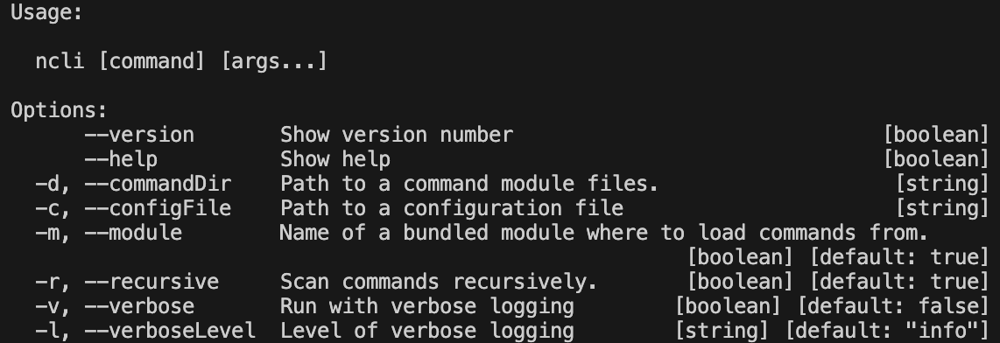

# @mrlm.net/node-console


> This package is BETA release and API might sligthly change!

Simple Node.js CLI application abstract framework to make console apps blazing fast with zero cofig and small efforts!

## Table of contents

- [Installation](#installation)
- [Usage](#usage)
  - [Basic](#basic)
  - [Code](#code)
  - [Code Advanced](#code-advanced)
  - [Creating Commands](#creating-commands)
- [Configuration](#configuration)

## Installation

Depending on your use case you can install package as normal or development dependency. Storing package as development dependency could be useful when you are using this tool just for local development related automations. Also you can create bundle with CLI core and your commands to create your own CLI package which users can use via `NPX`.

```shell
$ yarn add @mrlm.net/node-console
```

> If you'd like to add it as development dependecy use `$ yarn add -D @mrlm.net/node-console` command.

or 

```shell
$ npm install --save @mrlm.net/node-console
```

> If you'd like to install it as development dependecy use `$ npm install --save-dev @mrlm.net/node-console` command.

## Usage

This small CLI framework was designed to be used as binary CLI command executor (via `NPX`) or `JS/TS` module to be inserted into your own CLI application. Each command is represented by isolated ES module and package can be used as zero-config complex scripts executor.

### CLI usage 

```shell
$ npx @mrlm.net/node-console [command] [...options]
```

#### CLI Options



### Code

```typescript
#!/usr/bin/env node
import "@mrlm.net/node-console/autoloader";
```

### Code

```typescript
#!/usr/bin/env node
import { Engine } from "@mrlm.net/node-console/engine";

(async () => {
  new Engine({
      // Global options goes here
  });
})();
```

### Creating Commands

Creating of a command was never easy as now, you just need to place your commands to the folder named surprisingly `commands` into the root of your project, you can also configure this by passing `commandDir` configuration property or CLI flag. Pretty simple, huh?

#### ECMA Script syntax

```typescript
// Required
export command: string;
export handler(engine, yargs): void;
// Optional
export aliases?: string[];
export builder?: (yargs) => yargs.Args | yargs.Args
```

#### CommonJS syntax

```typescript
// Required
exports.command: string;
exports.handler(engine, yargs): void;
// Optional
exports.aliases?: string[];
exports.builder?: (yargs) => yargs.Args | yargs.Args
```

## Configuration